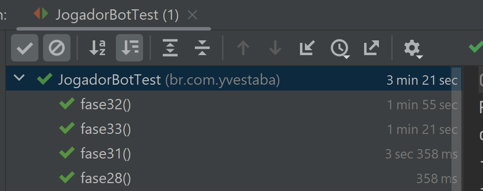

Teste seus jogos pelo teste do JUnit, usando os objetos que extendem a classe "Peca". 
O nome de todas as peças estão no arquivo NomeDasPecas.pdf que é gerado no método Main localizado na classe PrintadorDePecas. 
Sempre que adicionar uma nova subclasse de peça, rode o PrintadorDePecas para atualizar a documentação. 

Testes unitários no PC Acer Nitro AN515-44 

1.0 - Loop simples testando todas as possibilidades sem exceção

1.1 - A peça menor fica por último e sua posição é selecionada pelo sistema ao invés de testar um por um

1.2 - Divide o jogo em 3 pilhas de peças, as maiores, a menor de todas e as restantes. Depois das maiores, verifica se
a quantidade de mudanças disponíveis batem com a quantidade de mudanças que realmente podem ser feitas e decide se continua
tentando com a combinação ou não.
